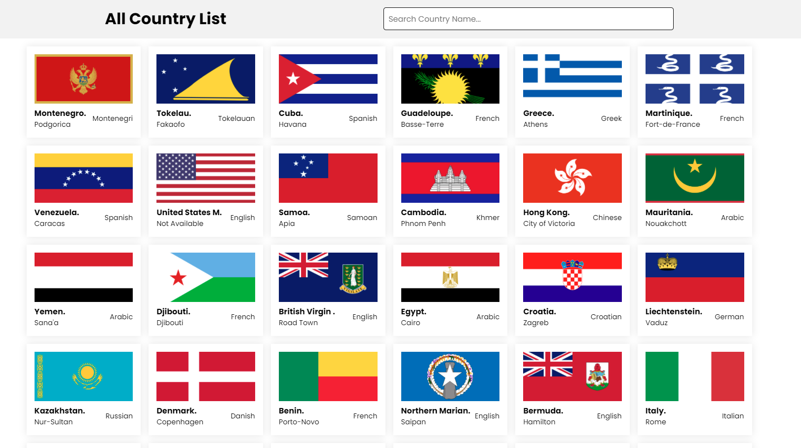

# Countries List With Modal 

This is api project for showing country list and make it dynamic using rest-country API;

# Using Technologies
- HTML5/HTML
- CSS3/CSS
- Vanilla JavaScript
- ES6 Features
- Google Fonts (poppins)
- VS Code Editor
- REST API (REST COUNTRIES 🇵🇪)
- Github/Git bash
- Windows Terminal
many more....

# Features
- Showing All Countries with Nice UI
- Search Any Country by the name
- Click to see country details
- Preloader system

# Live link in the about

# Demo Preview of project

> Thanks for reach out me on github.